# ERP Completo: Módulo de Planejamento e Controle Logístico (PCL)

## Visão Geral

O projeto **ERP Completo** visa desenvolver uma solução robusta e modular de Enterprise Resource Planning (ERP) com foco inicial no **Módulo de Planejamento e Controle Logístico (PCL)**. Este módulo é projetado para otimizar e automatizar as operações logísticas de ponta a ponta, desde o pedido comercial até o carregamento final para entrega, garantindo eficiência, rastreabilidade e conformidade fiscal.

Este `README.md` serve como a documentação principal para desenvolvedores, contribuidores e usuários interessados em entender a arquitetura, o fluxo de trabalho e as funcionalidades do módulo PCL.

## Sumário

- [Visão Geral](#visão-geral)
- [Sumário](#sumário)
- [Processo Logístico Detalhado (Módulo PCL)](#processo-logístico-detalhado-módulo-pcl)
  - [1. COML (Comercial - Pedido de Venda - OV)](#1-coml-comercial---pedido-de-venda---ov)
  - [2. PROGRAMAÇÃO / PLANEJAMENTO](#2-programação--planejamento)
  - [3. RECEBIMENTO (RECES)](#3-recebimento-reces)
  - [4. EXPEDIÇÃO](#4-expedição)
  - [5. CROSS-DOCKING](#5-cross-docking)
  - [6. SEPARAÇÃO (Picking)](#6-separação-picking)
  - [7. FATURAMENTO](#7-faturamento)
  - [8. ROTERIZAÇÃO](#8-roteirização)
  - [9. CARREGAMENTO](#9-carregamento)
- [Fluxograma Técnico Detalhado do Processo Logístico](#fluxograma-técnico-detalhado-do-processo-logístico)
- [Análise Crítica de PCL e Oportunidades de Melhoria](#análise-crítica-de-pcl-e-oportunidades-de-melhoria)
- [Métricas do Projeto](#métricas-do-projeto)
  - [Total de Commits](#total-de-commits)
  - [Status das Issues](#status-das-issues)
  - [Ranking de Contribuidores](#ranking-de-contribuidores)
- [Tecnologias Utilizadas](#tecnologias-utilizadas)
- [Como Contribuir](#como-contribuir)
- [Licença](#licença)
- [Contato](#contato)

## Processo Logístico Detalhado (Módulo PCL)

O módulo PCL implementa um fluxo logístico abrangente, garantindo a gestão eficiente de cada etapa. Abaixo, detalhamos cada fase, suas entradas, processos e saídas.

### 1. COML (Comercial - Pedido de Venda - OV)

Esta é a **etapa inicial** do processo logístico, onde a demanda do cliente é formalizada. É o ponto de partida para todas as operações subsequentes.

*   **Entradas:** Solicitação do cliente, dados de produtos e serviços, condições comerciais negociadas.
*   **Processo:** O pedido de venda (OV) é registrado no sistema. São coletadas informações cruciais como `DATA` do pedido, `ID PEDIDO` (identificador único), `ID DEVIDO` (identificador do cliente devedor), `ID ORIGEM` (local de origem da mercadoria), `ID DESTINO` (local de entrega), e as `JANELA INÍCIO` e `JANELA FIM` (período de tempo para a entrega). Além disso, a `TABELA FRETE/VEN` é consultada para determinar os custos de transporte e as condições comerciais aplicáveis, influenciando a precificação final e a viabilidade logística.
*   **Saídas:** Pedido de Venda formalizado e registrado, `LISTA PEDIDOS` (compilação de pedidos para planejamento).

### 2. PROGRAMAÇÃO / PLANEJAMENTO

Com o pedido comercial registrado, esta etapa foca no **planejamento detalhado** da execução logística, considerando os recursos disponíveis e as restrições operacionais para otimizar o transporte e a movimentação.

*   **Entradas:** Pedido de Venda registrado (ID Pedido, Destino, Janelas), `LISTA PED` (Lista de Pedidos), dados detalhados do produto (Peso, Volume, Valor, Tratamento Especial).
*   **Processo:** O `Processamento do XML` é uma etapa crítica que inicia o planejamento logístico. Ele envolve o **cadastro e armazenamento das notas fiscais de entrada de fornecedores** em formato XML. Este processo permite que a empresa receba eletronicamente os dados da nota fiscal (como itens, quantidades, pesos, volumes, valores e dados do remetente/destinatário) antes mesmo da chegada física da mercadoria. Essa antecipação é fundamental para o **despacho em 24 horas**, pois permite que a equipe de PCL:
    *   **Valide os dados:** Confere a conformidade dos dados da NF-e com o pedido de compra.
    *   **Programe o recebimento:** Agende a doca e o horário para a descarga, otimizando o fluxo.
    *   **Prepare a armazenagem/cross-docking:** Já defina a localização ou o direcionamento para cross-docking.
    *   **Inicie a roteirização preliminar:** Com base nos dados do XML, uma `ROTA` preliminar pode ser definida, considerando o `PESO` e o `M3` (volume em metros cúbicos) da carga. O `VALOR` da mercadoria e o `ESPEC` (Tratamento Especial, como Frágil, Perigoso, ou Específico) são avaliados para determinar requisitos especiais de manuseio e transporte. Um `HORÁRIO` e `DOCA` específicos são agendados para o recebimento ou expedição. Finalmente, um `ID PKT` (Identificador do Pacote) é gerado e uma `ETIQ` (Etiqueta) é impressa para rastreabilidade, tudo isso antes da chegada física do produto.
*   **Saídas:** Pedido programado com dados de rota e agendamento, `ID PKT`, `ETIQ` (Etiqueta de identificação).

### 3. RECEBIMENTO (RECES)

Esta etapa é responsável pela **entrada física dos produtos** no centro de distribuição ou armazém, garantindo que a mercadoria recebida esteja em conformidade com o que foi pedido.

*   **Entradas:** Produtos físicos, `ID PACOTE` (Identificador do Pacote), dados de peso e volume esperados, `ROTA` de origem, `TRAT.` (Tratamento) especial.
*   **Processo:** É realizada a `CONF. FÍSICA` (Conferência Física) dos produtos. Cada item é verificado quanto à quantidade, qualidade e integridade. O resultado da conferência é registrado como `OK` (conforme) ou `NOK` (não conforme). Os dados de `DATA/HORA` do recebimento, `PESO` e `VOLUME` reais são registrados. Em caso de `NOK`, o processo pode ser direcionado para `Logística Reversa / Devolução`.
*   **Saídas:** `BR` (Boletim de Recebimento), produtos conferidos e prontos para a próxima etapa (armazenagem ou cross-docking), ou produtos separados para logística reversa.

### 4. EXPEDIÇÃO (Sub-processo do Recebimento/Programação)

Esta etapa, embora muitas vezes integrada ao recebimento ou programação, foca na **preparação imediata dos produtos para movimentação**, especialmente quando não há necessidade de armazenamento prolongado.

*   **Entradas:** Produtos conferidos (OK), dados de agendamento (Horário, Doca), `ESPEC. VEÍCULOS` (Especificação de Veículos).
*   **Processo:** Os produtos são preparados para serem direcionados ao cross-docking ou diretamente para a separação. Veículos são designados com base nas `ESPEC. VEÍCULOS` e o `HORÁRIO` e `DOCA` são confirmados para a movimentação.
*   **Saídas:** Produtos prontos para cross-docking ou separação, veículos designados para a próxima fase.

### 5. CROSS-DOCKING

O cross-docking é uma estratégia logística que visa **minimizar o tempo de armazenamento**, movendo os produtos diretamente do recebimento para a expedição, com pouca ou nenhuma estocagem intermediária.

*   **Entradas:** Produtos recebidos e preparados, `ID PACOTE`, `ROTA` de destino.
*   **Processo:** Os produtos são rapidamente movimentados para a área de expedição. É feita a `Identificação: Rua/Módulo/Nível/Vão` para controle temporário da localização. Os pacotes são agrupados e uma `OS` (Ordem de Serviço) é gerada para consolidar os itens que seguirão para a separação.
*   **Saídas:** `OS` (Ordem de Serviço), produtos agrupados e prontos para a separação/picking.

### 6. SEPARAÇÃO (Picking)

Nesta etapa, os itens são **coletados e preparados** para atender a um pedido específico do cliente, focando na precisão e na integridade da embalagem.

*   **Entradas:** `OS` (Ordem de Serviço), produtos do cross-docking ou estoque, `ID PKTS` (Identificador de Pacotes).
*   **Processo:** Os volumes são coletados (`Coleta de Volumes`) de acordo com a Ordem de Serviço. Após a coleta, os produtos são submetidos à `Embalagem`, onde são protegidos e preparados para o transporte. É registrado o `QTDE VOLUME` (Quantidade de Volume) e o `ID VOLUME` para controle. Uma `PACKING LIST` (Lista de Embalagem) é gerada, detalhando o conteúdo de cada pacote.
*   **Saídas:** `PACKING LIST`, produtos embalados e prontos para a próxima etapa.

### 7. FATURAMENTO

Esta é uma **etapa crucial de formalização fiscal**, onde os documentos necessários para a circulação legal da mercadoria são emitidos. Sem o faturamento, o transporte não pode ocorrer legalmente.

*   **Entradas:** `PACKING LIST`, produtos embalados, dados de peso e volume finais.
*   **Processo:** Com base na `PACKING LIST` e nos dados finais dos produtos, são emitidos o `CTE` (Conhecimento de Transporte Eletrônico) e a `NF-e` (Nota Fiscal Eletrônica). Estes documentos formalizam a venda e a movimentação da mercadoria, sendo essenciais para a conformidade fiscal e legal.
*   **Saídas:** `CTE`, `NF-e`, `Manifesto de Carga` (documento que lista todos os CT-es de um veículo).

### 8. ROTERIZAÇÃO

Com os documentos fiscais emitidos, esta etapa foca na **otimização do transporte**, definindo as rotas mais eficientes para a entrega dos pedidos.

*   **Entradas:** `NF-e`, `CTE`, `ID PEDIDO`, `DESTINO`, dados de veículos, `HORÁRIO` e `DOCA` de expedição.
*   **Processo:** É realizada a `Otimização de Rotas`, considerando múltiplos destinos, janelas de entrega, capacidade dos veículos, tipos de carga e condições de tráfego. O objetivo é minimizar custos e tempo de trânsito. Uma `OC` (Ordem de Coleta) é gerada, detalhando a sequência de paradas e a ordem de entrega.
*   **Saídas:** Rotas otimizadas, `OC` (Ordem de Coleta) com a sequência de entregas.

### 9. CARREGAMENTO

Esta é a **etapa final antes do transporte**, onde os produtos são fisicamente carregados nos veículos, seguindo a lógica da roteirização para garantir eficiência na descarga.

*   **Entradas:** `OC` (Ordem de Coleta), veículos, produtos faturados e roteirizados.
*   **Processo:** É realizada uma `CHEC SAÍDA` (Checagem de Saída) para garantir que todos os itens da `OC` estejam presentes e que o `VEÍCULO` correto está sendo carregado. O carregamento físico dos volumes é feito seguindo a ordem da roteirização (LIFO - *Last In, First Out*), onde o último item a ser carregado será o primeiro a ser descarregado. O `HORÁRIO` de saída do veículo é registrado.
*   **Saídas:** Veículo carregado e pronto para partida, registro de saída.

## Fluxograma Técnico Detalhado do Processo Logístico

```mermaid
graph TD
    subgraph COML [1. COMERCIAL]
        A[Pedido de Venda - OV] --> B[Tabela Frete/Venda]
        B --> C[Lista de Pedidos]
    end

    C --> D[2. PROGRAMAÇÃO / PLANEJAMENTO]

    subgraph PLANEJ [2. PROGRAMAÇÃO]
        D --> E{Processar XML}
        E --> F[Definição de Rota/Peso/M3]
        F --> G[Agendamento: Horário/Doca]
        G --> H[Geração de Etiqueta / ID PKT]
    end

    H --> I[3. RECEBIMENTO]

    subgraph RECEB [3. RECEBIMENTO]
        I --> J[Boletim de Recebimento - BR]
        J --> K{Conferência Física}
        K -- OK --> L[Disponível para Fluxo]
        K -- NOK --> M[Logística Reversa / Devolução]
    end

    L --> N[4. EXPEDIÇÃO]

    subgraph EXPED [4. EXPEDIÇÃO]
        N --> O[Especificação de Veículos]
        O --> P[Horário/Doca Confirmados]
    end

    P --> Q[5. CROSS-DOCKING]

    subgraph CROSS [5. CROSS-DOCKING]
        Q --> R[Identificação: Rua/Módulo/Nível/Vão]
        R --> S[Ordem de Serviço - OS]
    end

    S --> T[6. SEPARAÇÃO / PICKING]

    subgraph SEP [6. SEPARAÇÃO]
        T --> U[Coleta de Volumes]
        U --> V[Embalagem]
        V --> W[Packing List]
    end

    W --> X[7. FATURAMENTO]

    subgraph FAT [7. FATURAMENTO]
        X --> Y[Emissão de NF-e]
        Y --> Z[Emissão de CT-e]
        Z --> AA[Manifesto de Carga]
    end

    AA --> AB[8. ROTERIZAÇÃO]

    subgraph ROT [8. ROTERIZAÇÃO]
        AB --> AC[Otimização de Rotas]
        AC --> AD[Ordem de Coleta - OC]
    end

    AD --> AE[9. CARREGAMENTO]

    subgraph CARR [9. CARREGAMENTO]
        AE --> AF[Especificação de Veículos]
        AF --> AG[Checagem de Saída]
        AG --> AH[Carregamento de Doca]
    end

    AH --> AI((FIM DO PROCESSO))

    style COML fill:#f9f,stroke:#333,stroke-width:2px
    style PLANEJ fill:#bbf,stroke:#333,stroke-width:2px
    style RECEB fill:#dfd,stroke:#333,stroke-width:2px
    style EXPED fill:#cff,stroke:#333,stroke-width:2px
    style CROSS fill:#ffd,stroke:#333,stroke-width:2px
    style SEP fill:#fdd,stroke:#333,stroke-width:2px
    style FAT fill:#f96,stroke:#333,stroke-width:2px
    style ROT fill:#dff,stroke:#333,stroke-width:2px
    style CARR fill:#eee,stroke:#333,stroke-width:2px
    style AI fill:#0f0,stroke:#333,stroke-width:4px
```

## Análise Crítica de PCL e Oportunidades de Melhoria

O fluxo logístico consolidado demonstra uma estrutura robusta e detalhada, com pontos de controle e rastreabilidade em diversas etapas. A seguir, uma análise crítica com pontos fortes e oportunidades de melhoria, considerando todas as informações extraídas:

### Pontos Fortes:

*   **Rastreabilidade Aprimorada:** A utilização de `IDs` (Pedido, Pacote, OS, PL) em diversas etapas, juntamente com o detalhamento de `Rua`, `Módulo`, `Nível` e `Vão` no cross-docking, permite um nível de rastreabilidade da mercadoria ao longo do processo ainda mais granular e preciso.
*   **Controle de Qualidade e Conformidade:** A `Conferência Física (OK/NOK)` na etapa de Recebimento, agora complementada pelo `BR` (Boletim de Recebimento), é um ponto crítico para garantir que os produtos recebidos estejam em conformidade com o pedido, minimizando erros e devoluções futuras. A inclusão da `NF-e` no faturamento reforça a conformidade fiscal.
*   **Otimização de Armazenagem/Movimentação:** A inclusão do **Cross-docking** com detalhes de localização (`Rua`, `Módulo`, `Nível`, `Vão`) indica uma estratégia avançada para reduzir o tempo de permanência dos produtos no armazém, diminuir custos de estocagem e acelerar o fluxo de mercadorias.
*   **Planejamento Detalhado e Integrado:** A fase de Programação considera dados como `Peso`, `M3` (volume), `ROTA`, `ESPEC` (Tratamento Especial), `HORÁRIO` e `DOCA`, além da `Tabela Frete/Ven` na etapa comercial. Isso demonstra uma preocupação em otimizar o transporte, garantir a segurança e integridade da carga, e integrar custos de frete desde o início.
*   **Documentação Completa e Eletrônica:** A geração de documentos como `Lista de Pedidos`, `Boletim de Recebimento`, `Packing List`, `CT-e` e `NF-e` assegura a conformidade legal, fiscal e operacional. A menção de `XML` na programação sugere a utilização de troca eletrônica de dados, o que agiliza o processo e reduz erros.
*   **Foco na Expedição, Faturamento, Roteirização e Carregamento:** A inclusão das etapas de `Expedição`, `Faturamento`, `Roteirização` e `Carregamento` com `CHEC SAÍDA` e `VEÍCULO` demonstra um controle rigoroso na fase final antes do transporte. O faturamento precede a roteirização e o carregamento, garantindo a conformidade fiscal antes da movimentação física. A roteirização, por sua vez, precede o carregamento, assegurando que a mercadoria correta seja carregada no veículo certo, na ordem adequada para a entrega, e no horário planejado.

### Oportunidades de Melhoria e Considerações de PCL:

*   **Integração de Sistemas (Reforçado):** A presença de `XML` e a complexidade do fluxo de dados entre as etapas `COML`, `PROGRAMAÇÃO`, `RECEBIMENTO`, `EXPEDIÇÃO`, `CROSS-DOCKING`, `SEPARAÇÃO`, `FATURAMENTO`, `ROTERIZAÇÃO` e `CARREGAMENTO` reforçam a necessidade de sistemas integrados (ERP, WMS, TMS). A automação da troca de informações é crucial para reduzir erros manuais, acelerar o processo e fornecer dados em tempo real para tomadas de decisão estratégicas.
*   **Gestão de KPIs (Aprofundado):** O mapeamento expandido do processo oferece ainda mais oportunidades para a definição de Indicadores Chave de Performance (KPIs). Sugere-se a criação de um dashboard para monitorar métricas como:
    *   **Lead Time Total e por Etapa:** Tempo total desde o `ID Pedido` até o `Carregamento`, e tempos específicos para cada fase (ex: tempo de recebimento, tempo de separação, tempo de faturamento, tempo de roteirização, tempo de carregamento).
    *   **OTIF (On-Time, In-Full):** Percentual de pedidos entregues no prazo e completos, agora com mais pontos de controle para identificar desvios.
    *   **Acuracidade do Inventário/Estoque:** Comparação entre o `PESO` e `VOLUME` registrados no `RECEBIMENTO` e o `QTDE VOLUME` na `SEPARAÇÃO`, além da acuracidade das localizações no cross-docking (`Rua`, `Módulo`, `Nível`, `Vão`).
    *   **Custo por Entrega/Rota:** Análise dos custos associados a cada `ROTA` e `DESTINO`, considerando a `Tabela Frete/Ven` e os `ESPEC. VEÍCULOS`.
    *   **Utilização de Doca:** Eficiência no uso das `DOCAS` de recebimento e expedição.
*   **Previsão de Demanda (S&OP):** A fase de `PROGRAMAÇÃO` se beneficiaria de uma integração ainda mais robusta com a previsão de demanda (S&OP - Sales and Operations Planning). Isso permitiria um planejamento mais proativo, otimizando a alocação de recursos (veículos, docas, mão de obra) e evitando gargalos.
*   **Gestão de Riscos e Tratamento Especial:** Para itens com `TRAT.` (Tratamento Especial: Frágil, Perigoso), é fundamental ter planos de contingência e protocolos de segurança bem definidos. A análise de riscos para cada tipo de carga pode mitigar perdas e acidentes, especialmente com o detalhamento de `ESPEC. VEÍCULOS`.
*   **Otimização de Rotas Dinâmica (Roteirização):** A etapa de `ROTERIZAÇÃO` é fundamental para a eficiência do transporte. A implementação de sistemas de otimização de rotas dinâmicos, que considerem condições de tráfego em tempo real, capacidade de `VEÍCULO` e novas demandas, pode gerar economias significativas e melhorar o tempo de entrega. A roteirização bem executada é a base para um carregamento eficiente (LIFO - Last In, First Out).
*   **Gestão de Devoluções (Logística Reversa):** O fluxo ainda não detalha o processo de logística reversa. É importante considerar como os produtos `NOK` da `Conferência Física` ou devoluções de clientes são tratados, para garantir um ciclo completo e eficiente.

## Métricas do Projeto

As métricas a seguir são exemplos de como a produtividade e o status do projeto podem ser monitorados. Para um projeto Open Source real, estas métricas seriam geradas dinamicamente via APIs do GitHub ou ferramentas de CI/CD.

### Total de Commits

Atualmente, o projeto possui **[Número de Commits]** commits.

*Nota: Este valor representa o total de commits no repositório `erp_completo` e é atualizado automaticamente.*

### Status das Issues

Abaixo, apresentamos o status das issues do projeto em formato de gráfico de barras (Markdown):

**Issues Abertas:** 
`████████░░░░░░░░░░░░░░░░░░░░` ([% Abertas]%) - [Número de Issues Abertas] issues

**Issues Fechadas:** 
`████████████████████████████` ([% Fechadas]%) - [Número de Issues Fechadas] issues

> **Resumo Visual:**
> - **Abertas:** [Número de Issues Abertas] ([% Abertas]%)
> - **Fechadas:** [Número de Issues Fechadas] ([% Fechadas]%)
> - **Total:** [Total de Issues] issues

*Nota: Os valores acima são placeholders e seriam atualizados dinamicamente em um ambiente de CI/CD integrado ao GitHub.*

### Ranking de Contribuidores (Produtividade)

O ranking abaixo mede a produtividade dos contribuidores (excluindo o mantenedor principal) com base no volume de commits e na resolução de issues complexas neste projeto:

| Rank | Contribuidor | Commits | Issues Resolvidas | Índice de Produtividade |
|:----:|:-------------|:-------:|:-----------------:|:-----------------------:|
| 🥇 | **dev_logistica** | 85 | 18 | 72.1 |
| 🥈 | **code_master** | 42 | 8 | 45.0 |
| 🥉 | **new_contributor** | 15 | 3 | 25.0 |

*Nota: O Índice de Produtividade é calculado através de uma média ponderada entre commits e issues resolvidas. Os dados são fictícios e devem ser integrados com APIs do GitHub para atualização dinâmica.*

## Tecnologias Utilizadas

- **Linguagem Principal:** Python
- **Ferramentas de Diagramação:** Mermaid (para fluxogramas)
- **Controle de Versão:** Git / GitHub

## Como Contribuir

Se você tem interesse em contribuir para o projeto ERP Completo, siga os passos abaixo:

1.  Faça um fork do repositório: `https://github.com/mak213k/erp_completo`
2.  Clone o seu fork: `git clone https://github.com/SEU_USUARIO/erp_completo.git`
3.  Crie uma nova branch para sua feature ou correção: `git checkout -b feature/minha-nova-funcionalidade`
4.  Faça suas alterações e adicione testes, se aplicável.
5.  Certifique-se de que seu código segue os padrões de estilo do projeto.
6.  Faça commit das suas alterações: `git commit -m "feat: Adiciona nova funcionalidade X"`
7.  Envie suas alterações para o seu fork: `git push origin feature/minha-nova-funcionalidade`
8.  Abra um Pull Request (PR) para o repositório principal.

## Licença

Este projeto é distribuído sob a licença **[Nome da Licença]**. Como a licença não foi especificada, por padrão, o projeto será considerado como `Licença: none` até que uma licença Open Source seja formalmente definida e adicionada ao repositório (ex: MIT, Apache 2.0, GPLv3).

## Contato

Para dúvidas, sugestões ou colaborações, por favor, abra uma issue no repositório do GitHub ou entre em contato com os mantenedores do projeto.

**GitHub do Projeto:** [https://github.com/mak213k/erp_completo](https://github.com/mak213k/erp_completo)
